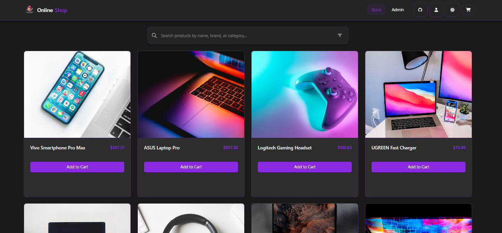

# Online Shop 

Welcome to the **Online Shop** project – 

- **Git & GitHub**
- **Linux**
- **Docker**
- **kubernetes**
- **Terraform**

### Project Details

### Content

- [**Situation**](#situation)
- [**Task**](#task)
- [**Action**](#action)
- [**Result**](#result--resume)

## Getting Started

1. Home Page

1. Admin Page

## Guidelines & Resources

Before diving into the tasks, please review the following key resources:

- [CONTRIBUTING.md](CONTRIBUTING.md): Guidelines for code contributions, commit messages, and overall coding standards.
- [COMMANDS.md](): Command used by me throught the project from Configuration to Deployment. `Except Git Commands`
- [ROADMAP.md](ROADMAP.md): Insights into the project vision, future enhancements, and milestones.
- **Repository Documentation:** Explore the repository to understand how the application is built. Pay special attention to the `src` directory where the main application logic resides, as well as configuration files such as `vite.config.js` and styling in `index.css`.

These documents provide the context needed to understand the project requirements and the best practices expected for your contributions.

---

